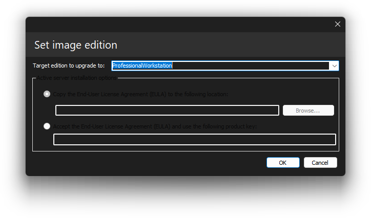

# Setting the image edition

    

With DISMTools you can set the edition of a Windows image. This action can be accessed by clicking Commands > Windows editions > Upgrade image...

## Target OS support

This action is supported on the following platforms:

| Platform | Supported? |
|:--:|:--:|
| Windows 7/Server 2008 R2 | ✔ |
| Windows 8/Server 2012 | ✔ |
| Windows 8.1/Server 2012 R2 | ✔ |
| Windows 10/Server 2016/2019/2022 | ✔ |
| Windows 11/Server 2025 | ✔ |

<i>This action is supported on DISMTools 0.6.2 and newer</i>

## Usage

Simply specify the edition you want to upgrade your Windows image to, and some additional options (in some cases which are reflected later).

## Options

**NOTE:** these options are only applicable to active Windows Server installations.

    

- Use *Copy the End-User License Agreement (EULA) to the following location* if you want to copy the EULA to a specific location
- Use *Accept the End-User License Agreement (EULA) and use the following product key* if you want to accept the EULA. This is required in order to change the edition on an online image

## Remarks

If the Windows image or installation already has the highest edition, you will not be able to perform this task. Check upgrade targets first by following the instructions in the image edition overview page.