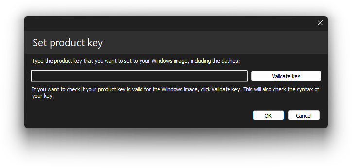

# Setting the image product key

    

With DISMTools you can set the product key of a Windows image. This action can be accessed by clicking Commands > Windows editions > Set product key...

## Target OS support

This action is supported on the following platforms:

| Platform | Supported? |
|:--:|:--:|
| Windows 7/Server 2008 R2 | ✔ |
| Windows 8/Server 2012 | ✔ |
| Windows 8.1/Server 2012 R2 | ✔ |
| Windows 10/Server 2016/2019/2022 | ✔ |
| Windows 11/Server 2025 | ✔ |

<i>This action is supported on DISMTools 0.6.2 and newer</i>

## Usage

Simply specify the product key you want to set on your Windows image. You can also verify if the product key is valid by clicking the "Validate key" button.

## Remarks

This is not applicable to active Windows installations.