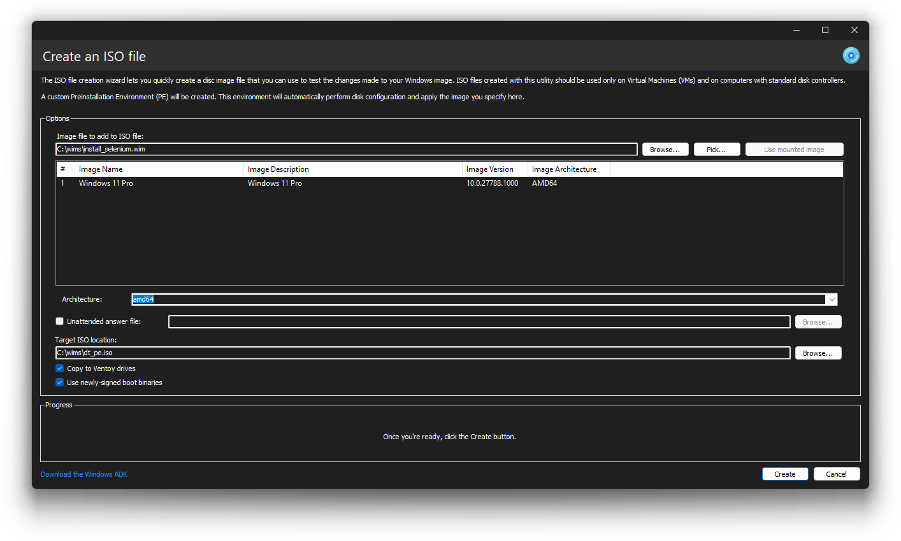

# Testing your Windows images with the ISO creation tools

	

If you want to test the changes made to a Windows image, you can easily do so with the ISO creation tools, which include the **ISO creator** and the **Preinstallation Environment (PE) Helper**.

You will need the Windows Assessment and Deployment Kit (ADK), which you can download using the convenient link on the bottom left. In DISMTools 0.7 and later, you can let the program automatically download and install the ADK for you. The following version is installed depending on the DISMTools version:

| DISMTools Version | ADK Version to Install | Manual Download Links |
|-------------------|-----------------------|----------------------|
| 0.7.2+ | ADK version 10.1.28000.1 | <ul><li>ADK: <a href="https://download.microsoft.com/download/615540bc-be0b-433a-b91b-1f2b0642bb24/adk/adksetup.exe">Download</a></li><li>Windows PE addon: <a href="https://download.microsoft.com/download/2472e9a0-7c74-4ffd-a3e4-27ed1fa30d30/adkwinpeaddons/adkwinpesetup.exe">Download</a></li></ul> |
| 0.7-0.7.2 Preview 4 | ADK version 10.1.26100.2454 | <ul><li>ADK: <a href="https://download.microsoft.com/download/2/d/9/2d9c8902-3fcd-48a6-a22a-432b08bed61e/ADK/adksetup.exe">Download</a></li><li>Windows PE addon: <a href="https://download.microsoft.com/download/5/5/6/556e01ec-9d78-417d-b1e1-d83a2eff20bc/ADKWinPEAddons/adkwinpesetup.exe">Download</a></li></ul> |

*This tool is available in DISMTools 0.5 and later.*

In DISMTools 0.7 and later, each of the sections have been split into their own pages. Follow these links in the following order:

1. [Creating an ISO file](./isocreator/isocreate.md)
2. Installing Operating Systems:
    - [Locally](./isocreator/install/localinstall.md)
    - [Using networks](./isocreator/install/netinst/pxehelpers.md)

Additional Tools:

- [Driver Installation Module](./isocreator/exttools/dim.md)
- [Extensibility Suite](./isocreator/exttools/dtpe_es.md)