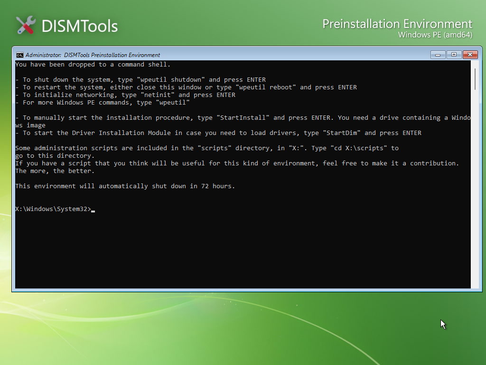

# Preinstallation Environment Command-line

In DISMTools 0.7 and later, the Preinstallation Environment allows you to load Command Prompt by pressing <kbd>C</kbd> at the main menu:

    

    

From this environment, you can run any command, including Administration Scripts included with this Preinstallation Environment, like you would in a regular Windows PE system. To learn more about Administration Scripts, see the [Administration Script Reference](./scriptref.md) page.

The environment will restart automatically after 72 hours (3 days).