# Unattended answer file creator

<p align="center">
    
</p>

The unattended answer file creator lets you create unattended answer files compatible with Windows 10 and 11 in 2 ways: an easy-to-use wizard, or a text editor

*This tool is available in DISMTools 0.5.1 and later*

## Creator modes

The creator contains 2 modes: an Express mode and an Editor mode. You can easily switch to either mode by clicking the buttons at the left corners of the window.

### Express mode

The express mode is useful for those who have never created answer files before or don't want to use text editors. Simply follow the steps of the wizard, and you will have your file in no time.

If you have a project loaded, DISMTools will let you save your unattended answer files to the unattended answer file folder of your project without you having to change directories. You can obviously save these files anywhere.

If you would like to learn more about the steps in this wizard, keep reading.

#### Wizard Steps

In the **Regional Configuration** page, you can set the language, system locale, keyboard layout and home location of the target system. Set these to values that suit your needs. Or, you can set them during the configuration of the applied operating system:

<p align="center">
    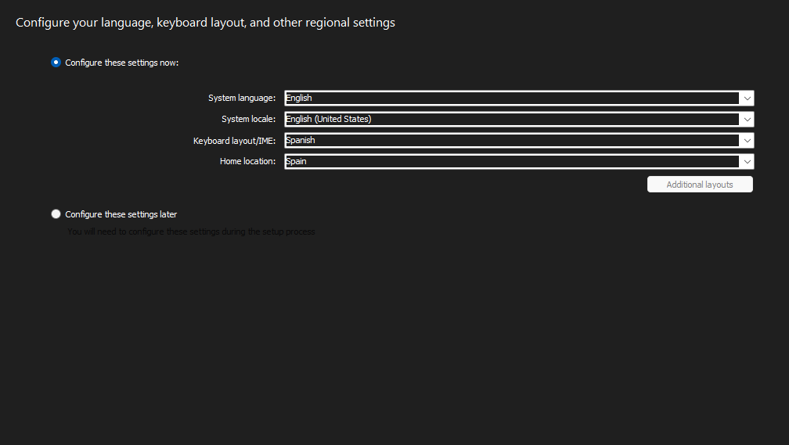
</p>

In the **System Configuration** page, you can set the computer name, the architectures that you wish to target with your answer file, and other settings:

<p align="center">
    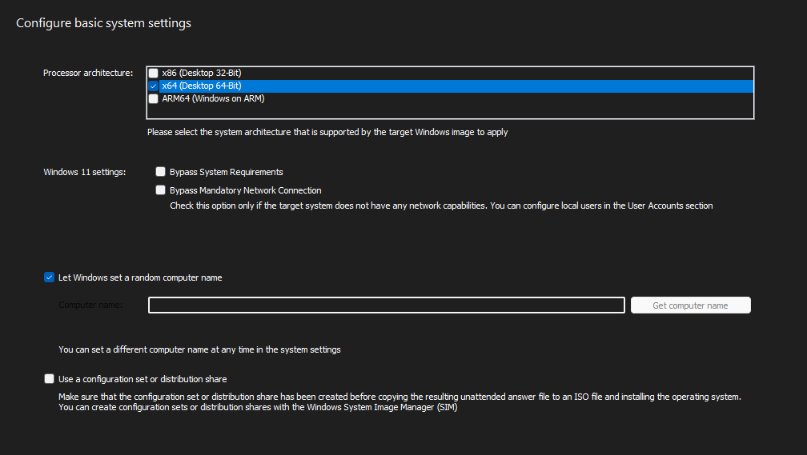
</p>

Additional options include:

- **Using a configuration set or distribution share**: a configuration set can be used to preload applications and drivers into the target image. You can create these sets with the Windows System Image Manager. Make sure that there is a configuration set on the ISO file to which you are copying the answer file
- **Windows 11 settings**: these help you bypass the system requirements and network connection setup. Configure the latter if the target system does not have network capabilities. If you are looking to bypass this to be able to create local accounts, you can create the user accounts from this wizard as well

In the **Time Zone** page, you can set the time zone of the target system:

<p align="center">
    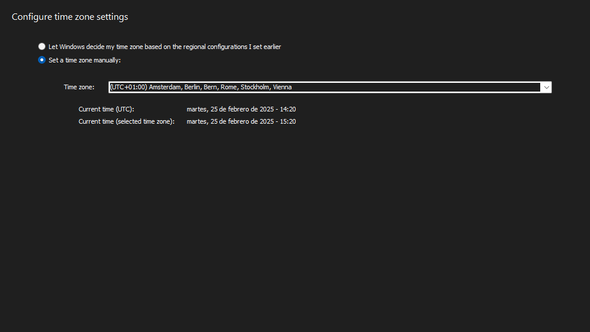
</p>

In the **Disk Configuration** page, you can set the disk configuration of the target system. You can let Setup give you the control over the disk configuration, or you can partition the first disk. You can also automate the entire disk configuration process by specifying DiskPart scripts:

<p align="center">
    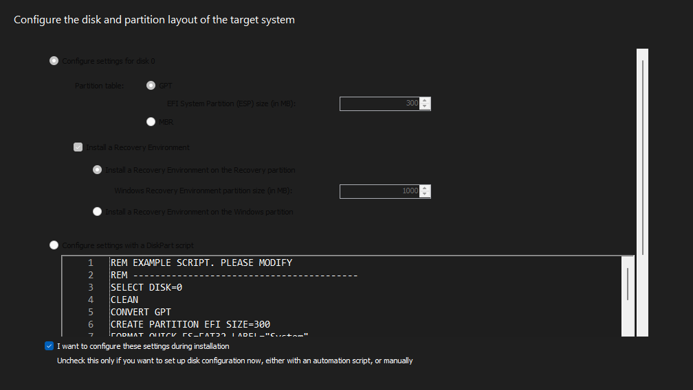
</p>

In the **Product Key** page, you can set the product key of the target system. You can choose from a generic product key tailored to the image edition, or you can type a custom product key:

<p align="center">
    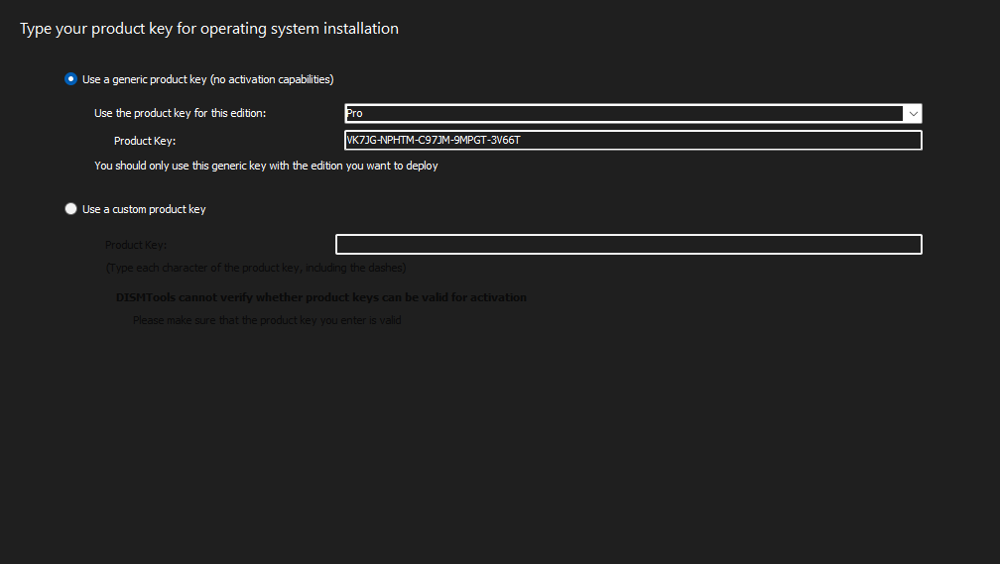
</p>

Notes:

- If you want to use a generic product key, choose the one tailored to your edition. Generic product keys are only meant for operating system installation, and will not activate the system
- If you want to use a custom product key, make sure that it is valid and that it is for the edition of the image. DISMTools will only check if the syntax of the product key is correct, but will not check if the product key is valid for installation or activation

In the **User Accounts** page, you can create the local user accounts of the target system. You can create up to 5 accounts, and you can set the password of each account:

<p align="center">
    
</p>

From here, you can also enable auto-logon settings for the target system. But, if you don't want to use local accounts, or want the operating system to ask you, you can skip this step.

You can also configure password expiration settings for the target system, but it is not recommended to do so, according to the [National Institute of Standards and Technology (NIST)](https://pages.nist.gov/800-63-FAQ/#q-b05):

<p align="center">
    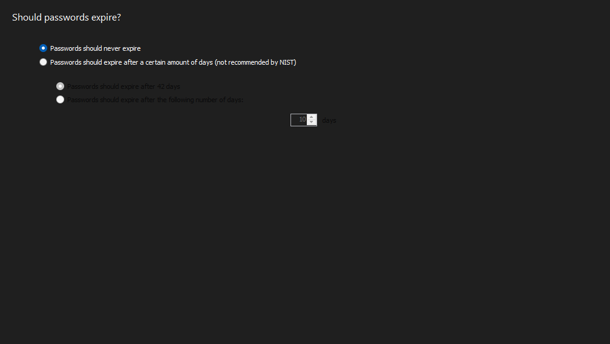
</p>

Finally, you can configure Account Lockout policies for the target system, or disable them. The latter is not recommended, as it can make the system more vulnerable to brute-force attacks:

<p align="center">
    
</p>

Notes:

- At least one account must be part of the Administrators group

In the **Virtual Machine Support** page, you can specify whether or not you want to install the integration features of your virtual machine provider (eg. VirtualBox Guest Additions or VMware Tools):

<p align="center">
    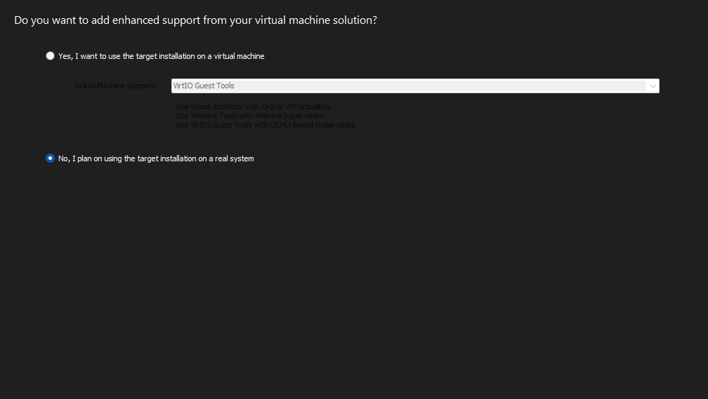
</p>

In the **Network Configuration** page, you can specify whether the target system will connect to a wireless network:

<p align="center">
    
</p>

Notes:

- The authentication technology must be supported by both the wireless router and the network adapter of the target system. Make sure that the system contains a wireless adapter first
- If you don't want to set up a wireless network connection, or if the target system does not contain a wireless adapter, choose *Skip configuration*

In the **System Telemetry** page, you can specify whether or not you want to send information to Microsoft and third-parties:

<p align="center">
    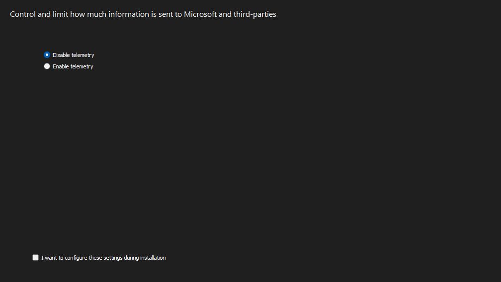
</p>

Notes:

- Choosing *Disable telemetry* will **not** disable all sources of data collection. You will have to perform additional modifications to your Windows image in order to further reduce data collection

In the **Post-Installation Scripts** page, you can configure additional scripts in PowerShell that will be run during Windows installation, or when accounts log on for the first time:

<p align="center">
    
</p>

You can either write the post-installation scripts from scratch, or import existing ones.

Notes:

- After scripts are done, you can restart Windows Explorer in case you have applied personalization changes, for example, via the Registry
- If you are new to the world of post-installation scripts, you can go with new Starter Scripts. Go to the starter script reference section (at the bottom of this page) for more information

In the **Component Settings** page, you can specify placeholders for additional components that you want to add to your answer file for specific passes. You will have to fill them in manually after the answer file is generated:

<p align="center">
    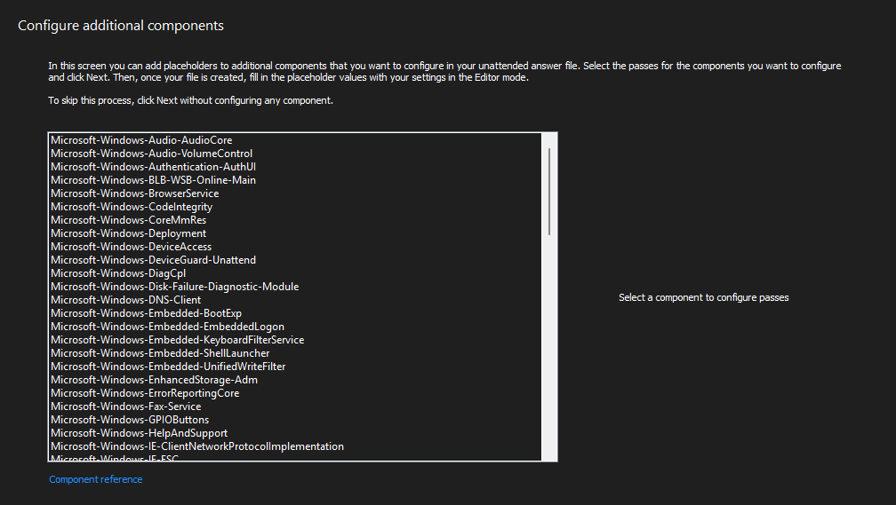
</p>

Notes:

- You can learn more about the components [here](https://learn.microsoft.com/en-us/windows-hardware/customize/desktop/unattend/components-b-unattend)
- You can fill in the placeholders in the Editor mode, or in the Windows System Image Manager
- If you don't want to configure components, simply skip this step

Finally, before creating the answer file, you can review the settings that you have configured in the wizard. If you want to change any settings, you can go back to the respective pages:

<p align="center">
    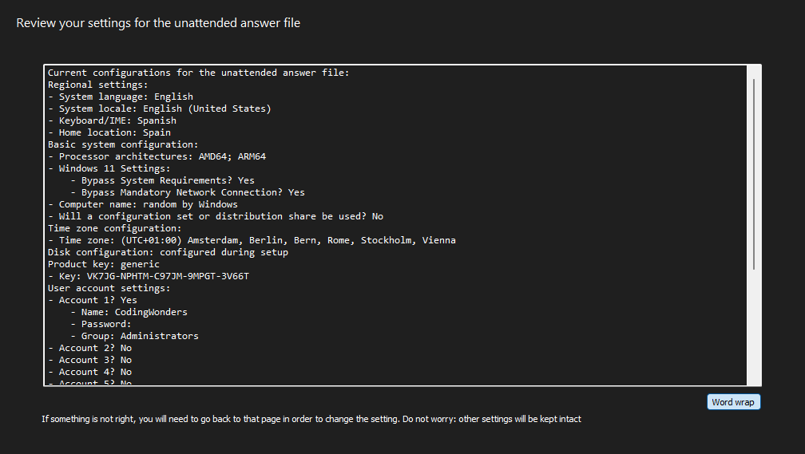
</p>

After creating the answer file, you can create another one, open the file location, apply it, or edit it with the Editor mode or the Windows System Image Manager.

### Editor mode

The editor mode lets you perform advanced customizations to your unattended answer file to add more things, like additional components or rules. You can operate the editor mode using the buttons in the toolbar.

<p align="center">
    
</p>

DISMTools 0.6.1 adds the ability to normalize the spacing of the answer file to make it consistent:

<p align="center">
    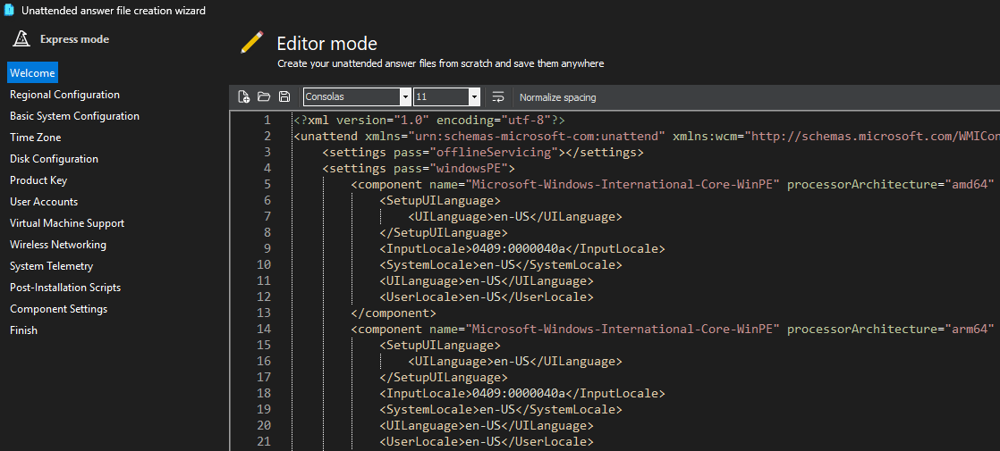
</p>

## Requirements

The unattended answer file creator requires the .NET 9 Runtime for the generator program to function. If DISMTools detects that the runtime hasn't been installed, you will be offered the ability to use the self-contained version, which contains the runtime:

<p align="center">
    
</p>

If you decide to use this version, DISMTools will save this preference until the self-contained version is removed, either manually, or due to a program update.

Downloading this version will take some time, depending on your network connection speed and computer performance. After the download is complete, you will see a notification in your system tray, depending on what icons are allowed to appear in the tray:

<p align="center">
    
</p>

Finally, like with the **Windows Image Explorer**, you can use the generator program separately. You can check out its repository [here](https://github.com/CodingWonders/UnattendGen)

## Active Directory Domain Services domain join

If the unattended answer file and, by extension, the Windows image, will be targeted to a fleet of computers in a domain; you can configure domain join settings using the **Domain Services Wizard**.

You can access the Domain Services Wizard by clicking the **Join target device to domain...** button that will appear in the following pages:

- System Configuration
- User Accounts
- Component Settings

<p align="center">
    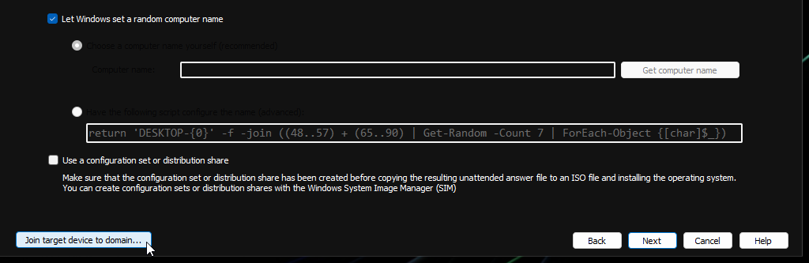
</p>

You will first need to configure target DNS server information: the primary domain suffix, the name of the NIC (*Interface Alias*), and DNS server addresses.

You can specify the interface alias in one of 2 ways:

- By picking from available NICs in the current system. To choose this, it is recommended that you verify if you are running DISMTools in one of the devices in the domain, unless your current device also has a NIC with the same name as the target devices
- By typing the name of the NIC manually

When you pick the NIC from the list, every other field (PDS, DNS server addresses) will be filled in automatically given the current configuration of the NIC. However, you can still change these fields if you need to use different values.

For DNS server addresses, you need to put one address per line. If you want to check if the syntax of the addresses is correct, click **Verify DNS Address Syntax**.

One example of filled-in information is shown below:

<p align="center">
    
</p>

After configuring DNS server information, you will need to configure information related to the initial user with which the target device will join the domain.

<p align="center">
    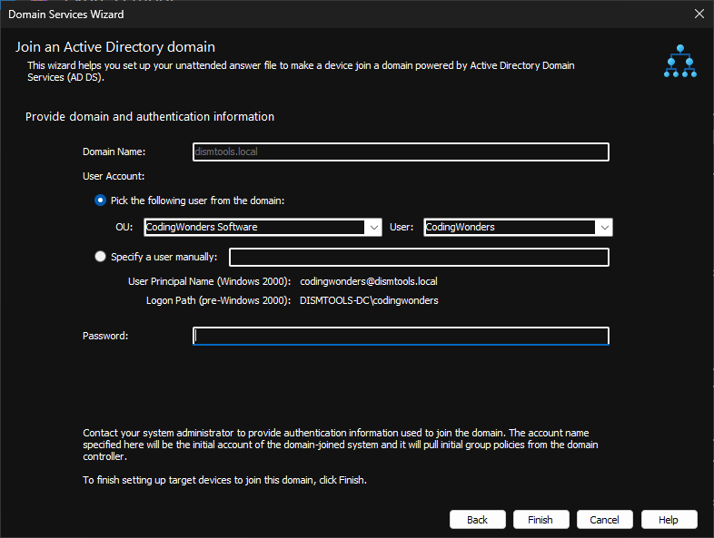
</p>

- If the device is part of a domain, the domain name will be filled in automatically and you will be able to pick users from available organizational units (OUs) in the domain. However, you can still specify different information manually.
- If the device is not part of a domain, you will need to specify all information manually.

To pick a user from the domain:

1. Select the OU from the drop-down list. After selecting the OU, the list of users in the OU will be populated automatically
2. Select the user from the list

Both the UPN and the SAM account names will be filled in automatically. When specifying this information manually, you will need to specify the user part of the UPN. For instance, `johndoe`.

Finally, specify the password of the user. Since DISMTools will **NOT** check if the password is correct, make sure that you type it correctly.

You've finished the Domain Services Wizard. When you get to the components screen, you will see that the necessary components and settings have been added to your answer file.

## Starter Script Reference

Currently, there are 12 starter scripts available:

| Script Name | Stage | Description |
|:------------|:-----:|:------------|
| Close First Logon Animation | During System Configuration | This script closes the First Logon Animation process and allows a system to reach the desktop sooner. This works on Windows 10 and Windows 11. |
| Enable Verbose Status Messages | During System Configuration | This script enables the verbose status messages that are enabled by default on Windows Server. This can help report service start/stop status. |
| Set OEM Information | During System Configuration | This script configures OEM settings such as the manufacturer or the model to further customize a Windows installation. |
| Set Quick Machine Recovery Settings | During System Configuration | This script configures a target system's Quick Machine Recovery settings on Windows 11 24H2 and later. |
| Configure folders for Git integration | When the first user logs on | This script configures a folder, or a set of folders, for Git source control integration in the File Explorer. Git and the latest versions of system components need to be installed in the target system to take advantage of all features. |
| Invoke WinUtil Configuration | When the first user logs on | This script configures a target system using a configuration file exported from the Windows Utility. |
| Set Personalization Settings | When the first user logs on | This script configures settings related to color modes and accent colors on the user environment of the target system. |
| Set Registered Owner and Organization | When the first user logs on | This script configures the registered owner and organization of the target system. |
| Set up a custom wallpaper | When the first user logs on | This script configures a wallpaper in the target system environment. |
| Update Microsoft Store apps | When the first user logs on | This script invokes an update of all Microsoft Store applications. A network is required for this to work. |
| Disable Second Chance OOBE | When users log on for the first time | This script disables the Second Chance Out-of-Box Experience on the target system. This works on Windows 10 and Windows 11. |
| Disable Windows Notification Sources | When users log on for the first time | This script disables user-specified notification sources in the target system. |

In DISMTools 0.7.2, you can view more information about these starter scripts more easily by using the new **Starter Script Browser**:

<p align="center">
    
</p>

Some scripts allow you to configure settings after you import them:

### Close First Logon Animation

**Script language**: Batch

No settings available.

### Set OEM Information

**Script language**: Batch

| Option | Required? | Description |
|:------:|:---------:|:------------|
| `OEM_Manufacturer` | Yes | The manufacturer of the system |
| `OEM_Model` | No | The model of the system |
| `OEM_SupportURL` | No | The support URL of the system |
| `OEM_SupportPhone` | No | The support phone number of the system |
| `OEM_SupportHours` | No | The support hours of the system |
| `OEM_Logo` | No | The path to the OEM logo of the system. Must be a BMP file |

### Set Quick Machine Recovery Settings

**Script language**: Batch

| Option | Required? | Description |
|:------:|:---------:|:------------|
| `QMR_CloudRemediation` | Yes | Enables (1) or disables (0) cloud remediation for QMR |
| `QMR_AutoRemediation` | Yes | Enables (1) or disables (0) automatic remediation for QMR |
| `QMR_NextCheckMinutes` | Yes | Sets the number of minutes before the next QMR check |
| `QMR_NextRebootHours` | Yes | Sets the number of hours before the next reboot |
| `QMR_Headless` | Yes | Enables (1) or disables (0) headless mode for QMR |

**Notes:**

- Options 3 and 4 will only be applied if automatic remediation is enabled
- Cloud Remediation allows the system to scan for solutions on WinRE launch
- Auto Remediation allows the system to continue scanning for solutions if the first attempt fails

### Configure folders for Git integration

**Script language**: PowerShell

To add new entries to the list of folders for which to show VCS information, add them to the following array, like this:

```powershell
$gitFolders = @(
	"$env:SYSTEMDRIVE\dev\repo1",
    "$env:SYSTEMDRIVE\dev\repo2"
)
```

Do note that, in order for the Git view to show, the system needs the *Windows Advanced Settings* application.

### Invoke WinUtil Configuration

**Script language**: PowerShell

You need to add your configuration file to the root of the image's mount directory, as `winutil-config.json`. You can learn more about configuration files [here](https://winutil.christitus.com/userguide/automation/).

### Set Personalization Settings

**Script language**: PowerShell

| Option | Description |
|:------:|:------------|
| `$lightThemeSystem` | If 0, sets the system theme to dark mode. If 1, sets it to light mode |
| `$lightThemeApps` | If 0, sets the app theme to dark mode. If 1, sets it to light mode |
| `$accentColorOnStart` | If 0, disables accent color on Start, taskbar and action center. If 1, enables it |
| `$enableTransparency` | If 0, disables transparency effects (Acrylic/Mica). If 1, enables it |
| `$htmlAccentColor` | Sets the accent color of the system. Must be a hex value |

### Set Registered Owner and Organization

**Script language**: Batch

| Option | Required? | Description |
|:------:|:---------:|:------------|
| `AutoUserInfo` | Yes | Determines whether to set registered owner as the name of the currently signed user (0 or 1) |
| `RegisteredUser` | Yes | The registered owner of the system |
| `RegisteredOrg` | No | The registered organization of the system |

**Notes:**

- If `AutoUserInfo` is set to 1 and a Microsoft account is used, the registered owner will be set to the first 5 letters of the email address
- This script should not be used when users log on for the first time because user information will change every time a new user logs on for the first time if the following conditions are met:
    - `AutoUserInfo` is set to 1
    - More than one user account is created, either from the answer file or after OOBE

### Set up a custom wallpaper

**Script language**: PowerShell

Place the wallpaper in any path inside the Windows image. Then, replace `<path to your wallpaper here>` with the actual path to your wallpaper starting from the mount directory of the Windows image. For example:

| Path in mount directory | Actual Path |
|:-----------------------:|:-----------:|
| `C:\mount\wallpaper.jpg` | `$env:SYSTEMDRIVE\wallpaper.jpg` |
| `C:\mount\Pictures\wallpaper.png` | `$env:SYSTEMDRIVE\Pictures\wallpaper.png` |

If the image file does not exist in the target image and continue with the script, you will see a black desktop background.

### Update Microsoft Store apps

**Script language**: Batch

No settings available.

### Disable Second Chance OOBE

**Script language**: Batch

No settings available.

### Disable Windows Notification Sources

**Script language**: Batch

By default, the script will disable the following notification sources:

- Suggested
- Startup App Notification
- OneDrive
- Microsoft Account Health
- Copilot (AppX package)

These entries will be added to list of notification sources, in Settings -> System -> Notifications. To add more entries to the list, do the following:

```batch
FOR %%a IN (Windows.SystemToast.Suggested ... Windows.SystemToast.AccountHealth <your source here>) DO (
    reg add "HKCU\Software\Microsoft\Windows\CurrentVersion\Notifications\Settings\%%a" /f
    reg add "HKCU\Software\Microsoft\Windows\CurrentVersion\Notifications\Settings\%%a" /v Enabled /t REG_DWORD /d 0 /f
)
```

Notes for your source:

- If your source contains spaces, surround it with quotes

### Change History

- DISMTools 0.7.2 Preview 3:
    - Added:
        - Configure Git folders for File Explorer
    - Modified:
        - Added name and description fields to starter scripts for script browser
- DISMTools 0.7.2 Preview 2:
    - Added:
        - Verbose Status Messages
    - Modified:
        - Disable Windows Notification Sources: added Copilot notifications to blocklist
        - Set Quick Machine Recovery Settings: added value checking
- DISMTools 0.7.1 Preview 4:
    - Added:
        - Disable Windows Notification Sources
        - Disable Second Chance OOBE
        - Set OEM Information
        - Set Registered Owner and Organization
        - Set Quick Machine Recovery Settings
    - Modified:
        - Invoke WinUtil Configuration: reduced ping count to server
- DISMTools 0.7.1 Preview 3:
    - Added:
        - Skip OOBE First Logon Animation
        - Personalize User Environment
- DISMTools 0.7.1 Preview 2:
    - Added:
        - Set up a custom wallpaper
        - Update Microsoft Store apps
        - Invoke WinUtil Configuration

## Acknowledgements

Special thanks to Christoph Schneegans for creating the library that makes this creator possible.