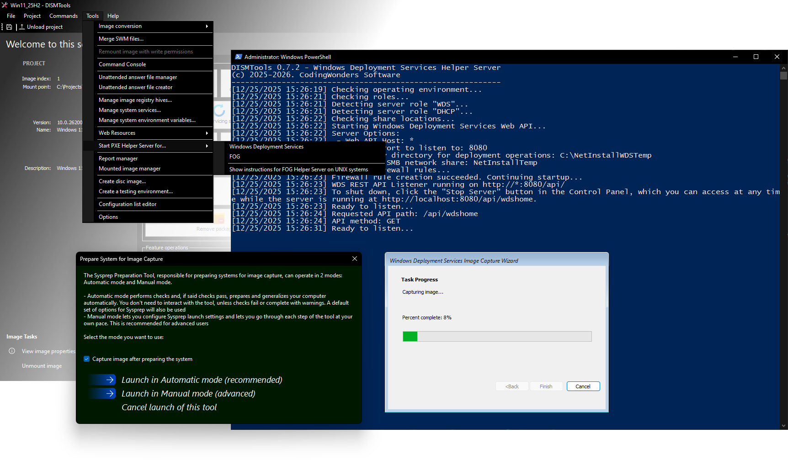

# Release highlights

This new version of DISMTools comes with new features that enhance image management and servicing tasks. Here are some of its key changes.

If you want to take a look at everything that has changed though, check out the [release notes page](https://github.com/CodingWonders/DISMTools/releases/latest) for more information.

## General improvements to the PE Helper and PXE Helpers

DISMTools 0.7.2 offers several improvements to the PE Helper and PXE Helper components. The Sysprep Preparation Tool now offers an automatic mode that prepares a reference computer with minimal user interaction. After preparation, the image capture script can now be launched automatically. Said script has also been improved to support capturing images to network locations using SMB shares and WDS servers.

The PE Helper has also seen revamped ADK detection procedures that work more reliably, and updated logic for OSCDIMG error handling.

The PXE Helper Server components can also be launched directly from the Tools menu on Windows servers.

  

## More starter scripts, more ways to customize your images; plus additional improvements to unattended answer file features

The unattended answer file creation wizard now includes more starter scripts for enabling verbose status messages and configuring specific folders for Git integration in the File Explorer. Starter scripts have also been improved to provide name and description information, that can be viewed in the new starter script browser:

  

## Spice up the program's look with new themes

Based on the theme engine introduced in DISMTools 0.7, this release adds new *tinted themes* in red, green, orange, and purple. Those who prefer a more minimal look can also go with the new **Tinted Black** and **Tinted White** themes, one for each color mode.

## Overall refinements

This release also focuses on refining existing tasks and functionality to improve the user experience. For example, the program is more reliable and components have been updated to their latest versions.

<!-- Room for more features -->

# Thanks to the contributors

The following people have helped shape this version of DISMTools by reporting issues or suggesting new features or changes:

[Real-MullaC](https://github.com/Real-MullaC), [bovirus](https://github.com/bovirus), [jekovcar](https://github.com/jekovcar), [rayman95 (MDL Forums)](https://forums.mydigitallife.net/members/rayman95.1153686/)

If you want to appear in this list, you can report issues or suggestions in any channel you prefer (via the [MDL forum thread](https://forums.mydigitallife.net/threads/dismtools.87263/), via the [GitHub repository](https://github.com/CodingWonders/DISMTools), or via any announcements on the [DISMTools subreddit](https://reddit.com/r/DISMTools) or on the [Windows](https://reddit.com/r/Windows), [Windows11](https://reddit.com/r/Windows11) and [Windows10](https://reddit.com/r/Windows10) subreddits (as comments)) or submit new code changes (read the [contribution guidelines](https://github.com/CodingWonders/DISMTools/blob/stable/CONTRIBUTING.md) for more information).