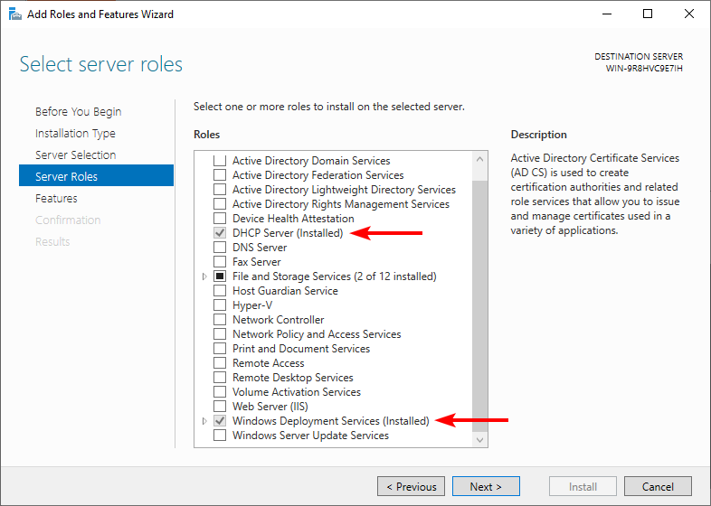

# Preparing your server

The first step is to prepare your server for PXE boot and, if not set up, your network infrastructure. This section will cover both tasks.

## Checking Server Roles

To successfully deploy operating systems via the network, you will need the following server roles:

- DHCP (Dynamic Host Configuration Protocol)
- Windows Deployment Services

**NOTE:** you can have a different server that acts as the DHCP server. In that case, you only need the WDS role:

You should be able to determine whether they are installed by simply searching for the management tools:


**NOTE:** if you don't use WDS, do not install the WDS role. This guide assumes that you will use WDS. However, DHCP is still required for PXE booting.

If not present, it's time to assess the current situation of the server. To do this:

1. Go to Server Manager
2. Click "Add roles and features", and perform a role-based or feature-based installation
3. Select your server, and check which roles are present. Both must be installed:

    
    
Based on this:

- *If they are not installed:*

    1. Check both DHCP and WDS and continue installation, whilst including management tools
    2. Continue without modifying any features, unless you want to enable or disable some of them
    3. Read the instructions for DHCP carefully
    4. In the configuration of the WDS role, leave both servers (deployment and transport) checked
    5. Proceed with the installation. After installing the roles, you will see that a role needs configuration. That is the DHCP role.
    6. As stated earlier, perform the configuration of the DHCP server
    
        
    
    7. Click "Commit" and "Close":
    
        
    
- *If they are installed, but the management tools are not present:*

    You will have to enable the `DHCPServer-Tools` and `Microsoft-Windows-Deployment-Services-Admin-Pack` features. You can do this by [enabling the features](../../features/enable_feature) from within the [online installation management mode](../../online_inst_mgmt).
    
    You may have to restart the server after enabling the features.

## Preparing the network infrastructure

If you already have a network infrastructure set up for remote deployment, feel free to skip this step. However, if you just want to tinker with remote installations at home with a wireless connection, you can do the following steps to create a virtual switch (*vSwitch*).

**Notes:** 

- These steps only work with Hyper-V
- After rebooting your host computer, your virtual machines connected to your switch may lose connection to the Internet. However, the switch will still function for remote OS installation
- Additional data consumption may occur

To set up the virtual switch:

1. In Hyper-V Manager, open the virtual switch manager and set up a new **Internal** switch. Give it the name you want, and click OK. You should have the following settings:

    

2. After creating the switch, press <kbd>Win</kbd> + <kbd>R</kbd> and run `ncpa.cpl`. Then, double-click your wireless NIC (*Network Interface Card*) and go to the adapter settings
3. Set up Internet Connection Sharing using the newly created switch. The resulting IP address from ICS is usually `192.168.137.1`

Finally, configure the server to use the new switch:


Turn on the server VM and run `ipconfig /all` to make sure the virtual network adapter is detecting the address used by Internet Connection Sharing as the default gateway. If so, then try pinging it:


**Tip:** if you want to make sure the IP address of the server doesn't change (remains static), or if it can't pick up the default gateway address, go to the network adapter properties of the virtual network adapter, and configure IPv4 to use the following values:


If the server can ping your computer, then you have a working vSwitch. You can now hook up the rest of the virtual machines you would like to use to that vSwitch.

## Configuring the DHCP Scopes

**NOTE:** the contents of this section, introduced in earlier 0.7 Previews, have been moved to the WDS guide in order to show setups that work with other providers and not just WDS. This guide will only cover how to set up DHCP scopes for PXE.

A DHCP server, in order to automatically assign IP addresses to clients, needs to have scopes with lengths that can contain the maximum amount of clients to use. If you already configured scopes, you can skip this step. Otherwise, keep reading.

Open the DHCP management tool, select your server, then go to IPv4. We'll create a basic IPv4 scope using a unicast transmission (more common).


Right-click IPv4 and select New scope. In the wizard, follow these steps:

1. Give your scope a name and an optional description to better identify it:

    

2. Next, provide an IP address range that will be used to provide addresses to clients (this is known as the **address pool**). It should have the same subnet mask you have configured in your server. For this guide, we'll create a scope that can host addresses to 51 clients:

    
    
3. If you don't want to assign addresses within a certain range, you can add exclusions to the scope. For this guide, we won't exclude addresses:

    
    
4. Configure the scope lease duration. A DHCP lease to a client can last for a given time before the server gives a different IP address to said client. The default of 8 days is usually fine, unless it is meant to be something else in your environment:

    

5. When asked to configure more details about the scope, select Yes and click Next. Then, specify the default gateway address for the scope. If you followed the guide on setting up the vSwitch, the gateway address you need to enter is the IP address offered by your host as part of Internet Connection Sharing. This is also the DNS address to add in the next screen if you set it up earlier:

    

6. After configuring the gateway address and the DNS server address, leave the WINS server section as is and click Next. When you're asked to activate the scope, select No and click Next:

    

7. In the newly created scope, right-click Scope Options, and select "Configure Options...":

    
    
8. Then, configure the following options as follows based on your deployment solution:

    | Provider | Option | Value |
    |----------|--------|-------|
    | <all\>   | 66     | IP address of TFTP server |
    | WDS      | 67     | `boot\<arch>\wdsnbp.com` |
    | FOG      | 67     | `ipxe.efi` (or other [iPXE](https://ipxe.org/) NBP binaries) |
    
    For example, for WDS:
    
    

9. Finally, right-click the scope and click "Activate"

## Final remarks

You can configure the aforementioned settings either in this scope or globally. In any case, if you want to use both platforms, you should prepare scripts that automate these tasks. Here's an example of how to do it:

```powershell
Set-DhcpServerv4OptionValue [-ScopeId "<IP Scope>"] -OptionId 66 -Value "<TFTP Server IP>"
Set-DhcpServerv4OptionValue [-ScopeId "<IP Scope>"] -OptionId 67 -Value "<TFTP NBP for provider>"
```

Only include the `-ScopeId` parameter if you want to set the option for a specific scope.