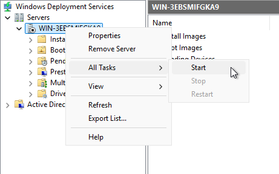
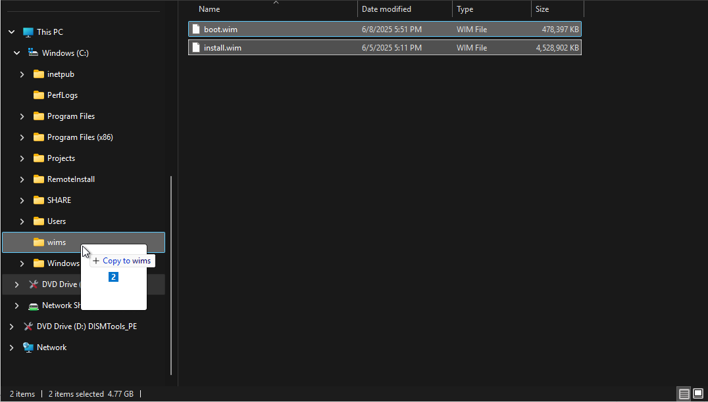
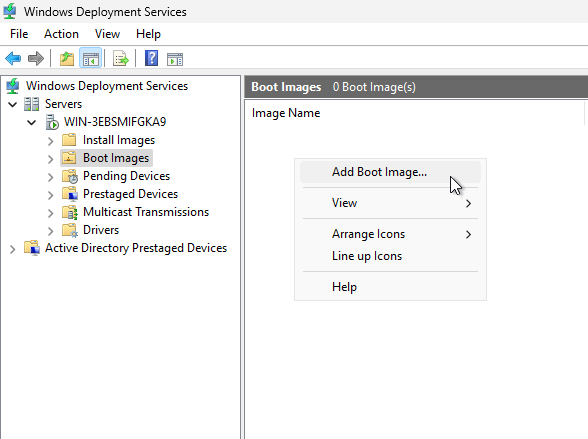
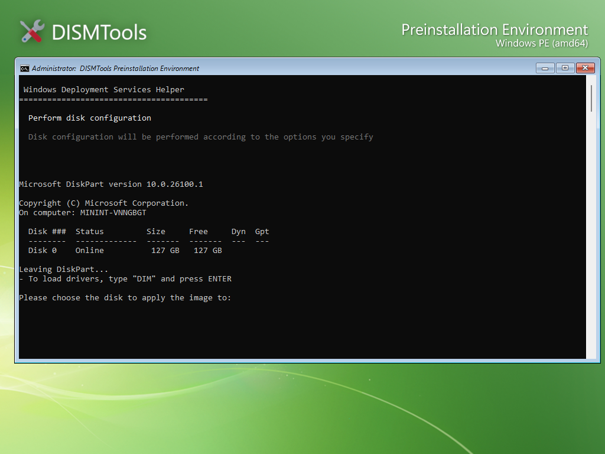

# Windows Deployment Services Helper

The WDS Helper allows you to deploy Windows images over the network using Windows Deployment Services (WDS). It is a part of the ISO creation tools and is available in DISMTools 0.7 and later.

## Setting up the WDS server

**NOTE:** this section was previously the continuation of the DHCP server preparation guide in earlier 0.7 previews. This guide assumes that you have already set up a DHCP server. If you haven't, please refer to the [DHCP server preparation guide](../setup).

Now that the server can use your switch, we'll need to configure it so that it can work with WDS. To do this, open the WDS management tool, and select your server. Then, right-click it and select "Configure Server":

Next, select the mode in which the server will operate. This cannot be changed afterwards without removing the server and reconfiguring it, so make sure that you select the correct mode.

If you have a different server that acts as a Domain Controller (DC) using Active Directory, or if the current server already acts as the DC, leave the first option checked. Otherwise, if you don't have a Domain Controller, or if you just want to tinker with network-based deployment, choose Standalone mode:

*For this guide, we'll go with the Standalone mode, since we don't have a domain controller*

Afterwards, select the path in which the remote installation files will be stored. By default, the `RemoteInstall` folder will be stored on the root of the system drive. Change it if it's necessary, but for our case it's fine:

The following step is very important, and depends on where you configured the DHCP server. If the WDS server is also the DHCP server, then leave both options checked. Otherwise, only leave the first option checked, and configure DHCP option 60 on the DHCP server. More on these options later in the guide:

Finally, you need to configure initial PXE settings to respond to both known and unknown client computers. Additionally, you can choose to require administrator approval for unknown clients. This gives you greater control over which devices can connect and which ones can't. You can modify the initial PXE settings later if you wish:

After clicking Next, the server will be configured and the WDS service will start. However, you may encounter this problem when trying to start the service:

If this happens, you can try starting the service manually by going here:

## Adding the Windows images

Before booting the clients to perform network-based deployments, we'll first need to add the Windows images. Here's how you can do it:

1. Insert or mount the ISO file that was just created, and copy all the WIM files to any folder on your server:

    

2. Then, in WDS, go to "(Your Server) -> Boot images", right-click the empty area and select "Add boot image..."

    

3. Next, select the boot image (`boot.wim`) and finish the wizard:

    

4. Afterwards, go to "(Your Server) -> Install Images", right-click the empty area and select "Add install image..."

    

5. This will require the creation of an image group. Name it however you want, and then specify the install image to add (`install.wim`):

    
    
    

6. The install image may contain more than 1 index. Check the ones that you want to deploy using WDS and finish the wizard. You can also provide custom names and descriptions for each of the indexes when deploying them through the network:

    
    
Finally, you should have this setup:

You can now start the PXE clients. In the server, you also need to start the server component of the WDS Helper. To do this, right-click `wdshelper_server.ps1` in `<Drive Root>\pxehelpers\wds`, and select "Run with PowerShell"

### Beginning installation via PXE

If you followed each step right, you should now see a screen like the following one:

If so, press <kbd>ENTER</kbd> now and wait for the DISMTools PE to start up. Once it starts up, select option 2 for network installation:

Eventually, you'll arrive at this screen. Provide the server IP address, the port to which the server is listening (usually port 8080), the name of the user that's hosting the images (in most cases, `Administrator`), and the password:

Choose your image from the list that will then appear, and the group it's in; and press ENTER:

After preparing the deployment of the image file, configure your disks accordingly:

Then, select the index:

And, finally, wait for the image to be applied:

